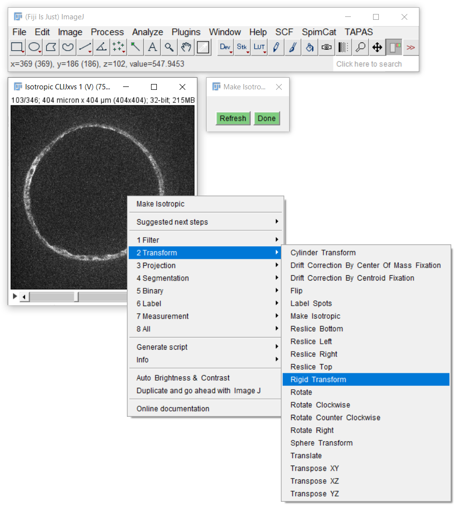

## Getting started CLIncubating image processing workflows
Open your 3D+channel+time data set. Consider using your data as [virtual stacks](https://imagej.nih.gov/ij/docs/guide/146-8.html)
if it's huge. Afterwards, activate CLIncubator by 

## Building workflows - step by step
CLIncubator has a built-in suggestions of what to do next:
 

 
[Image data source: Irene Seijo Barandiaran, Grapin-Botton lab, MPI CBG]

Consider them but also explore the cateories of all available operations. 

[Image data source: Irene Seijo Barandiaran, Grapin-Botton lab, MPI CBG]

## Concentrate on the crucial steps when optimizing parameters
After assembling your workflow, e.g. Make isotropic, Rigid Transform, Sphere transform and Maximum Z Projection, move
windows out of your field of view and concentrate on parameter optimization. In this case: Put the last three operations
next to each other, change the parameters of the rigid transform and inspect the results in the maximum Z projection.

<iframe src="images/clincubator_rigid_cylinder_max.mp4" width="540" height="260"></iframe>
[Download video](images/clincubator_rigid_cylinder_max.mp4) 
[Image data source: Irene Seijo Barandiaran, Grapin-Botton lab, MPI CBG]

