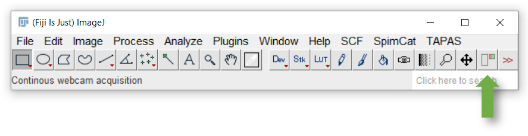
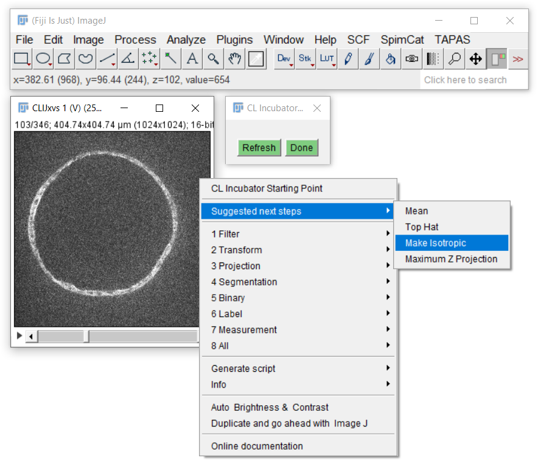
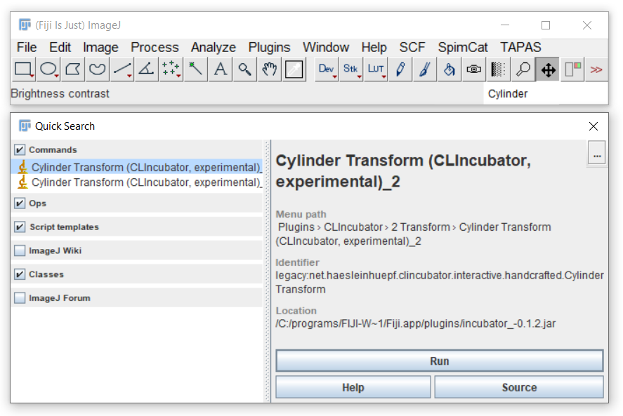

# Getting started clincubating image processing workflows
Open your 3D+channel+time data set. Consider using your data as [virtual stacks](https://imagej.nih.gov/ij/docs/guide/146-8.html)
if it's huge. Afterwards, activate CLIncubator by clicking on its tool icon.

## Building workflows - step by step
CLIncubator has a built-in suggestions of what to do next:. 
Just right click in any image that has been clincubated.

 
[Image data source: Irene Seijo Barandiaran, Grapin-Botton lab, MPI CBG]

Consider them but also explore the cateories of all available operations. 

[Image data source: Irene Seijo Barandiaran, Grapin-Botton lab, MPI CBG]

Last but not least, you also find all CLIncubator operations in Fijis search bar.

Back to [CLIncubator](https://clij.github.io/clincubator)
