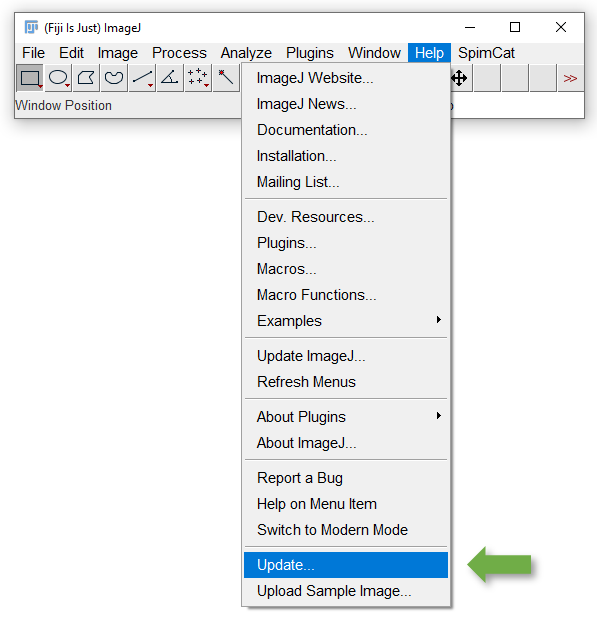
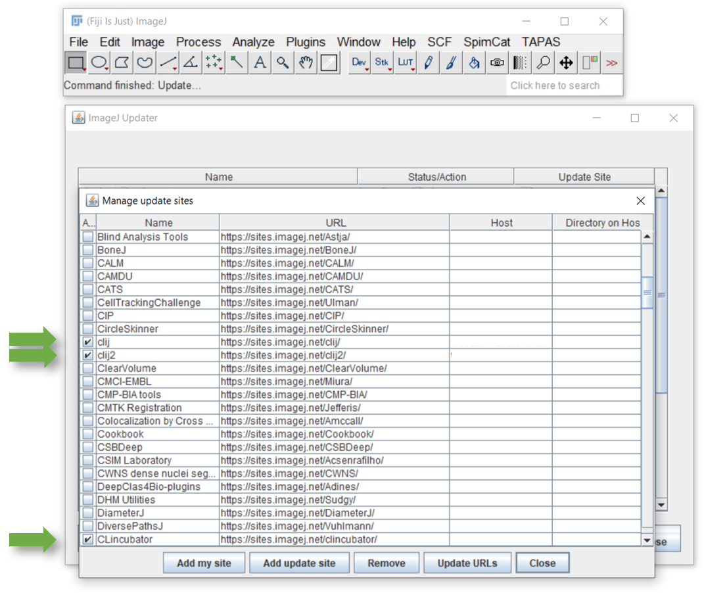

## CLIncubator installation instructions
* Download and unpack [Fiji](https://fiji.sc)
* Start Fiji and run its update using the menu `Help > Update`

* Click on "Manage update sites" and activate the two updates sites "clij" and "clij2". Furthermore, please click on 
"Add update site" and enter another "CLIncubator" update site with the URL "https://sites.imagej.net/clincubator/"

* Click on "Close"
* Click on "Apply Chanes"
* Restart Fiji

Installation was successful if you find the CLIncubator starting point button in Fijis tool bar:
