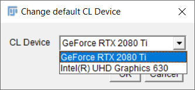
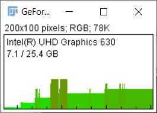

# CLIncubator installation instructions
* Download and unpack [Fiji](https://fiji.sc)
* Start Fiji and run its update using the menu `Help > Update`


* Click on "Manage update sites" and activate the two updates sites "clij" and "clij2". Furthermore, please click on 
"Add update site" and enter another "CLIncubator" update site with the URL "https://sites.imagej.net/clincubator/"


* Click on "Close"
* Click on "Apply Chanes"
* Restart Fiji

Installation was successful if you find the CLIncubator starting point button in Fijis tool bar:


## Hardware requirements
CLIncubator uses modern graphics cards to ensure real-time image processing experience. 
Therefore it is recommended to utilize state-of-the art graphics computing units (GPUs). 
When considering purchasing modern GPUs, please take into account:
* **Memory size**: As image processing is [memory-bound](https://en.wikipedia.org/wiki/Memory_bound_function) look out for GPUs with 
large memory. For typical scenarios it is recommended to buy GPUs with at least 8 GB of GDDR6 RAM memory.
* **Memory Bandwidth**: GPU vendors specify their products computing capabilities with various terminology and metrics. 
 look out for memory bandwidth: typical GDDR4-based GPUs have a memory bandwidth > 400 GB/s. 
 Quite some GDDR5 GPUs for example offer < 100 GB/s. 
 Thus, GDDR6-based GPUs may compute image processing results about 5 times faster!
* **Integrated GPUs**: If you desire processing images in long workflows, it might make sense to use integrated GPYs with access to huge amounts of DDR4-memory. 
They are more affordable.

You can check the capabilities of your graphics processing units by selecting a device using the menu `Plugins > ImageJ on GPU (CLIJx) > Change default CL device```



The menu `Plugins > ImageJ on GPU (CLIJx) > Memory Display` allows you to overview availabl memory and memory consumption while building your workflow.



Back to [CLIncubator](https://clij.github.io/clincubator)