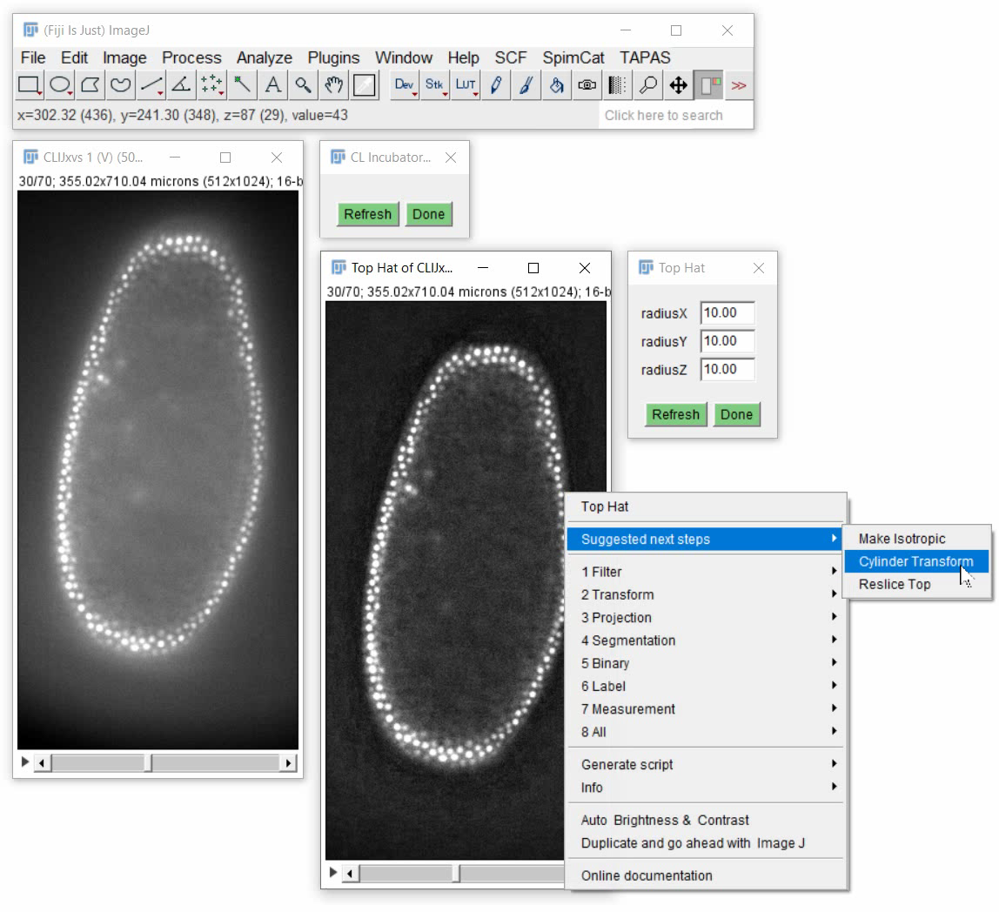

# CLIncubator - grow your image processing workflows!
CLIncubator is an intuitive user interface for building custom GPU-accelerated image processing workflows using [CLIJ2](https://clij.github.io) in [Fiji](https://fiji.sc).

## Building workflows - step by step
CLIncubator has a built-in suggestion system analysing common CLIJ workflows to make suggestions of what to do next. 
<iframe src="images/clincubator__working_principle.mp4" width="540" height="260"></iframe>
[Download video](images/clincubator__working_principle.mp4) [Image data source: Daniela Vorkel, Myers lab, CSBD / MPI CBG]

## Instant feedback
You can fine-tune parameters of your workflow while inspecting different z-planes or time points of your data set and see results instantly.
<iframe src="images/clincubator_instand_feedback.mp4" width="540" height="260"></iframe>
[Download video](images/clincubator_instand_feedback.mp4) [Image data source: Daniela Vorkel, Myers lab, CSBD / MPI CBG]

## Exporting workflows as ImageJ Macro
After you finished designing your image analysis workflow, you can export an ImageJ macro and apply it to image sequences systematically.

<iframe src="images/clincubator_generate_macro.mp4" width="540" height="260"></iframe>
[Download video](images/clincubator_generate_macro.mp4) [Image data source: Daniela Vorkel, Myers lab, CSBD / MPI CBG]

