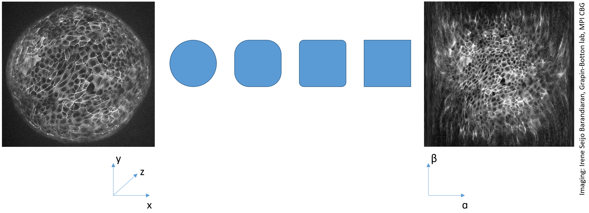

# Sphere projection
Similar to the [Cylinder projection](https://clij.github.io/clincubator/cylinder_projection) 
we can use a sphere projection to project intensities from a spherical sample into a 2D image. 

## How to use a sphere projection on your data
When applying sphere projections to image stacks, a rigid dransform in advance is helpful to have control of the position and tilt of your sample in projected space.

Open your time lapse data set. [Start the CLIncubator](https://clij.github.io/clincubator/getting_started) and follow these steps:

* Your dataset
  * CLIncubator Starting point
    * [Optional: Noise removal and Background subtraction]
      * Make Isotropic
        * Rigid transform
          * Sphere transform
            * Maximum Z projection

After assembling your workflow, put the last three operations next to each other, change the parameters of the 
rigid transform and inspect the results in the maximum Z projection.

<iframe src="images/clincubator_rigid_sphere_projection.mp4" width="540" height="540"></iframe>
[Download video](images/clincubator_rigid_sphere_projection.mp4) 
[Image data source: Irene Seijo Barandiaran, Grapin-Botton lab, MPI CBG]

Back to [CLIncubator](https://clij.github.io/clincubator)