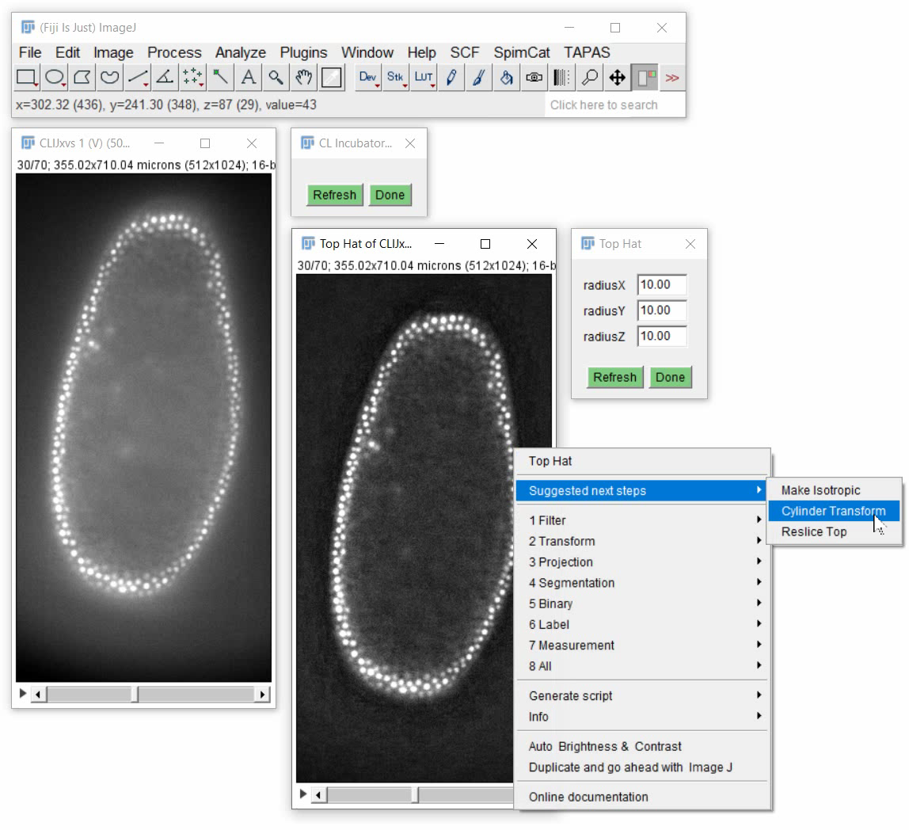

# CLIJx-Incubator - let your image processing workflows grow
[CLIJx-Incubator](https://clij.github.io/incubator) is an intuitive user interface for building custom GPU-accelerated image processing workflows using [CLIJ2](https://clij.github.io) in [Fiji](https://fiji.sc).

CLIJx-Incubator is under development and its API is subject to change. Please treat everything with care.
Do not use it for routine research yet. Planned release is early 2021. Stay tuned.

## Instant feedback
You can fine tune parameters of your workflow while inspecting different z-planes or time points of your data set and see results instantly.
<iframe src="images/incubator_segmentation_intro.mp4" width="500" height="800"></iframe>
[Download video](images/incubator_segmentation_intro.mp4) [Image data source: Daniela Vorkel, Myers lab, CSBD / MPI CBG]

## Overview
* [Installation](https://clij.github.io/incubator/installation)
* [Getting started](https://clij.github.io/incubator/getting_started)
* [Reference](https://clij.github.io/incubator/reference)

* [Image filtering](https://clij.github.io/incubator/filtering)
* [Drift correction](https://clij.github.io/incubator/drift_correction)
* Intensity correction

* [Maximum projection](https://clij.github.io/incubator/intensity_projection)
* [Cylinder projection](https://clij.github.io/incubator/cylinder_projection)
* [Sphere projection](https://clij.github.io/incubator/sphere_projection)
* Spot detection
* Cell segmentation
  * [Nuclei segmentation](https://clij.github.io/incubator/segmentation_nuclei)
* Cel neighbor analysis

* [Export workflows as ImageJ Macro](https://clij.github.io/incubator/macro_export)

## Wish list and known issues
* Add support for multi-channel data
* Add menu entry for "Apply to all time points"

Also have an idea for improving CLIJx-Incubator? Let me know! I'm eager to receiving feedback: rhaase at mpi minus cbg dot de

