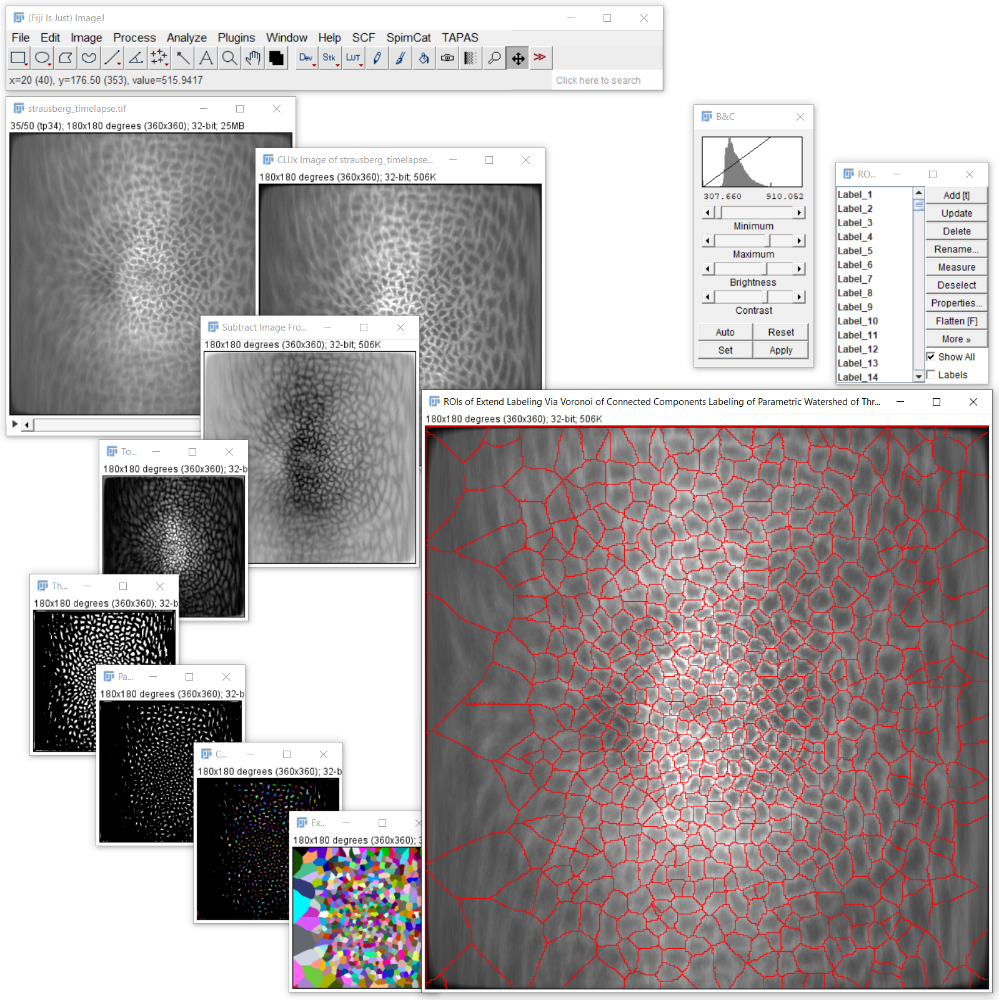

# Cell segmentation based on membrane markers
Cell segmentation based on membrane markers is challenging because usually contrast between cell body and cell membrane is small.
To improve on this, typically background subtraction methods are applied, for example:
* Top Hat
* Subtract Gaussian Background
* Difference of Gaussian

For increasing thickness of membranes a maximum filter may be helpful

An important step afterwards is typically inverting the image, for example with:
* Subtract Image from scalar
* Invert

Furthermore, spot detection techniques are applied to determine cell centers, for example:
* Find and label maxima
* Detect and label maxima

Alternatively, thresholding methods may also be able to differentiate cell body and cell memranes, for example:
* Threshold DoG, which is a combination of Difference of Gaussian and manual thresholding

Afterwards, labels as extended to mimic cell extesions, e.g.
* Extend labels with maximum Radius
* Extend labels via Voronoi

It is recommended to utilize modern [GDDR6-based GPU hardware](https://clij.github.io/incubator/installation#hardware) for 3D segmentation.

## How to do cell segmentation
Open your data set. [Start the CLIJx-Incubator](https://clij.github.io/incubator/getting_started) and follow such a workflows:

* Your dataset
  * CLIJx-Incubator Starting point
    * [Optional: Noise removal]
      * Subtract Image From Scalar 
        * Top Hat 
          * Threshold DoG 
            * Parametric Watershed 
              * Connected Components Labeling 
                * Extend Labeling Via Voronoi 
                  * Pull To ROIManager 
      
After assembling your workflow, tune the parameters. Usually, only small values for sigma and radii are needed when segmenting cells based on 

[Image data source: Daniela Vorkel, Myers lab, CSBD / MPI CBG]

Back to [CLIJx-Incubator](https://clij.github.io/incubator)